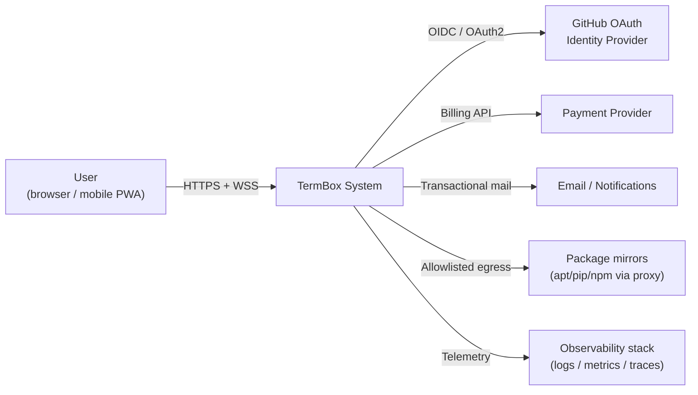
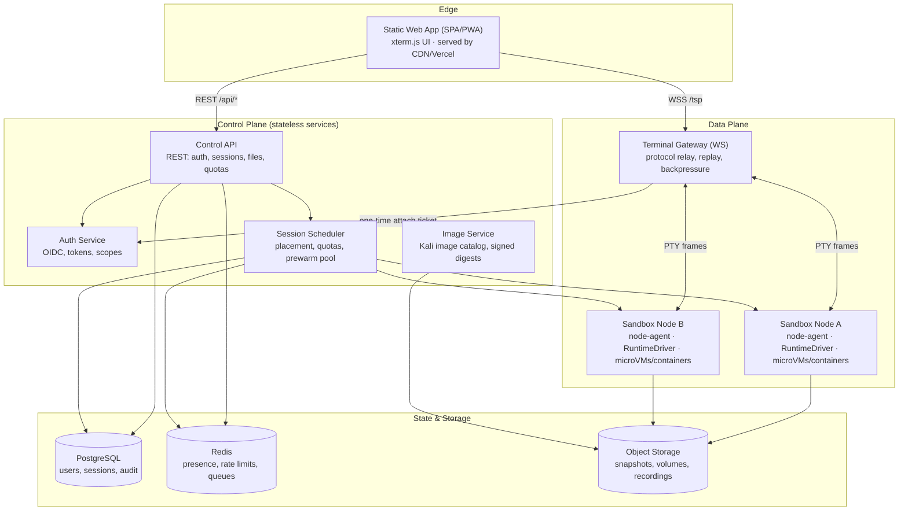
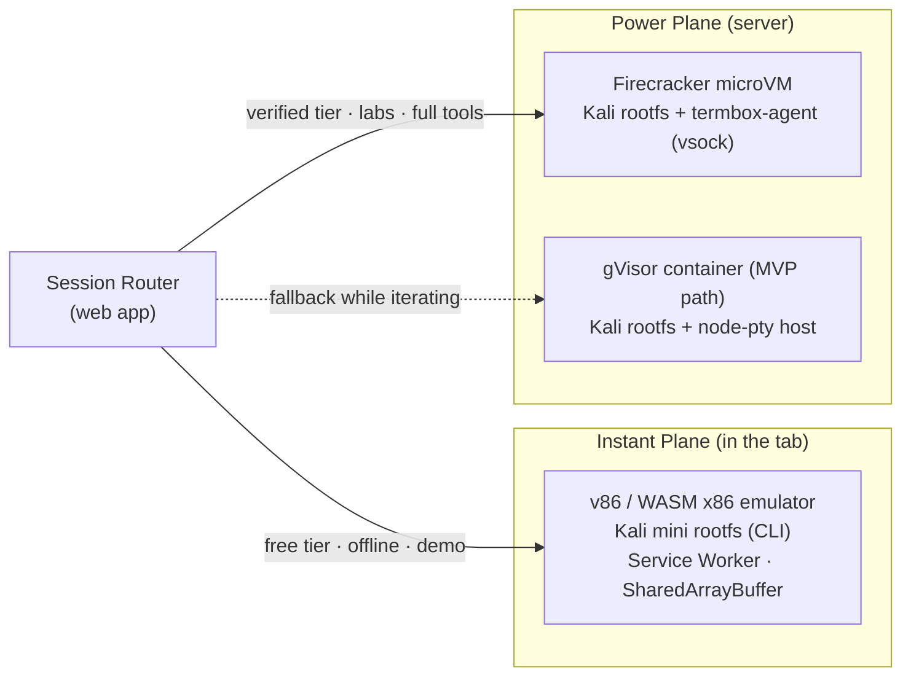
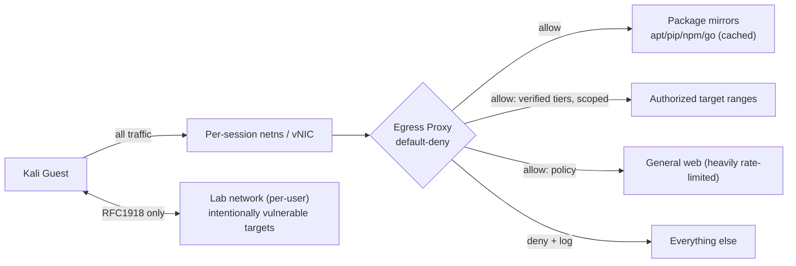
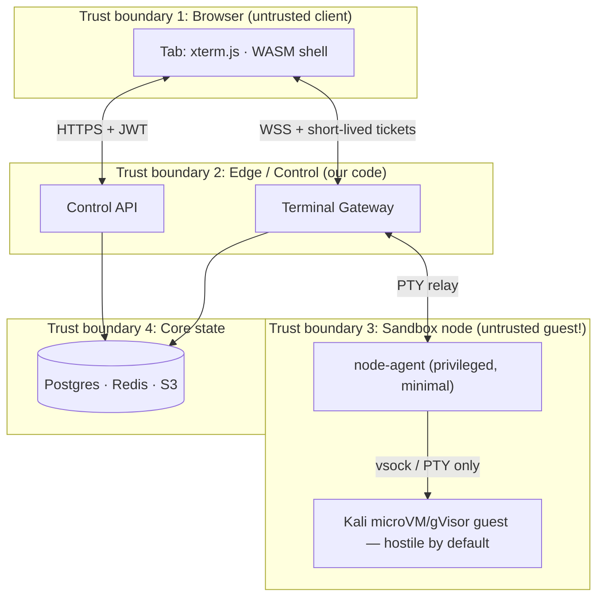

# TermBox — System Architecture
### A browser-native, terminal-first Linux workspace that runs real Kali Linux

**Status:** Living document · Source of truth for the production architecture
**Scope:** Phases 1–3 (the production system). Phase 0 (the shipped static prototype) is described in `README.md`.
**Companion docs:** `docs/ENGINEERING_GUIDELINES.md` (how we think), `docs/adr/` (settled decisions), `AGENTS.md` (repo rules).

---

## 1. Product definition

**TermBox is Termux for the web:** you land on a real shell in seconds, run real
Linux tooling (Kali Linux in particular), and step into a GUI workspace (files,
packages, activity) without leaving the product. The terminal is lightweight
enough to feel native in a browser tab — including on a phone — while the compute
behind it is strong enough for genuine security work.

### 1.1 Personas

| Persona | Job to be done | Tier |
| --- | --- | --- |
| **Learner** | "Give me a safe Kali sandbox to practice in, instantly, with zero install." | Free / Instant Plane |
| **Practitioner (authorized pentester)** | "Give me a real Kali environment with my tools and a scoped target lab, from any machine." | Paid / Power Plane |
| **Educator** | "Give a class of 30 identical, disposable lab environments with pre-built targets." | Teams |
| **Developer** | "Give me a Linux shell + files + scripts without a VM on my laptop." | Free → Paid |

### 1.2 Product principles (locked)

1. **Terminal first** — the first screen is a shell. Everything else is a door off it.
2. **GUI when it helps** — files, packages, activity, and tools as views over the
   *same* session state, never a separate world.
3. **Real compute, honest labels** — never pretend a simulator is a real shell
   (Phase 0 simulates and says so). Every shell is labeled with its runtime tier.
4. **Safe by construction** — hostile guest, hostile client, hostile network:
   isolation is the architecture, not a feature.
5. **Lightweight front end** — budget-enforced JS payload, 60fps terminal,
   mobile-first input (Termux-style extra-keys row).

---

## 2. Quality attribute scenarios (the acceptance envelope)

Architecture exists to hit these. Each is measurable; each maps to a test or
instrument in later phases.

| # | Attribute | Scenario | Target |
| --- | --- | --- | --- |
| Q1 | Performance | Keystroke echo, same-region, 10k concurrent sessions | p95 < 50 ms, p99 < 150 ms |
| Q2 | Performance | Cold start: browser load → first prompt (Instant Plane) | < 3 s on 4G |
| Q3 | Performance | Warm attach to existing Power Plane session (resume) | < 1 s |
| Q4 | Performance | Cold provision of Power Plane session | < 10 s |
| Q5 | Availability | Attach attempts succeed over 28 days | ≥ 99.9 % |
| Q6 | Availability | Gateway deploy or node loss → session resumes from snapshot | < 10 s, RPO ≤ 60 s |
| Q7 | Security | Cross-tenant data access (any vector) | **0** — invariant, Sev-1 if violated |
| Q8 | Security | Guest escape to host/other guests | Treated as Sev-1; containment within one node pool |
| Q9 | Modifiability | Swap sandbox runtime (container ↔ microVM) | No frontend/API contract change |
| Q10 | Cost | Infra cost per std session-hour | ≤ $0.05 (measured, alarmed) |
| Q11 | Usability | Full terminal flow operable on a 375px viewport with on-screen keys | Passes scripted mobile checks |
| Q12 | Operability | Answer "why did session X die?" from telemetry alone | < 5 min (flight recorder) |

---

## 3. System context (C4 Level 1)



Everything user-visible flows through the TermBox system; identity is delegated
to GitHub (already the repo's identity), everything else is contracted.

---

## 4. Container view (C4 Level 2)



**Boundary rules (invariants):**
- The web app never talks to a sandbox directly — only through Gateway/Control API.
- Sandboxes have **no inbound** connectivity except from their node-agent.
- Sandboxes reach the outside world only through the **egress proxy** (default-deny).
- Postgres has exactly one writer path per datum: the service that owns it.

---

## 5. The core problem: what "run Kali Linux in the web app" actually means

A browser cannot execute Linux processes. There are exactly three credible
substrates, and TermBox deliberately uses two of them (ADR-001):

| Substrate | What it is | Speed | Isolation | Cost | Verdict |
| --- | --- | --- | --- | --- | --- |
| **A. In-browser Linux (v86 / WASM x86 emu)** | Full Linux kernel + rootfs emulated in WebAssembly, runs in the tab | ~10–50× slower than native; ≤ 1–2 GB RAM | Perfect (JS sandbox) | $0 server | **Instant Plane** — boot-in-tab Kali CLI for demos, learning, offline |
| **B. Server sandbox (Firecracker microVM / gVisor container)** | Real Kali userspace on real CPU, PTY streamed to the tab | Native | MicroVM = hardware VM boundary (strong); gVisor = kernel syscall sandbox (good) | $/session-hour | **Power Plane** — the real product |
| **C. Remote full VM / SSH box** | Classic VPS per user | Native | Strong | $$$, slow provision | Rejected as primary (cost, cold start); viable as BYO later |

**Why a hybrid:** users judge the product by *time-to-first-prompt* (A wins) and
by *whether real tools work* (B wins). The architecture runs A instantly in the
browser and B for real work — one UI, one protocol, two runtimes behind the same
`RuntimeDriver` contract. If the Power Plane is down or unaffordable, the Instant
Plane is the honest degradation path.

### 5.1 Runtime planes



### 5.2 RuntimeDriver contract (the seam that keeps Q9 true)

```text
interface RuntimeDriver {
  provision(spec: SessionSpec): Promise<SandboxHandle>   // image, cpu, ram, disk, net-policy
  attach(handle, pty: PtyChannel): Promise<void>          // stream stdio
  resize(handle, cols, rows): Promise<void>
  snapshot(handle): Promise<SnapshotRef>                  // pause + persist (state on disk)
  restore(ref): Promise<SandboxHandle>                    // resume with processes intact
  destroy(handle): Promise<void>
  inspect(handle): Promise<UsageStats>                    // cpu/mem/net for metering
}
```

Implementations: `FirecrackerDriver`, `ContainerDriver` (gVisor/runsc), and
`WasmDriver` (browser-side, mirror of the same interface for the Instant Plane).
The scheduler, gateway, and UI speak only this vocabulary.

### 5.3 Kali image pipeline (supply chain included)

1. **Build** minimal Kali rootfs (`kali-debootstrap` / mkosi-style) — core CLI
   first, tool sets (web, wireless, forensics…) as layers. Target: **< 800 MB**
   core, lazy-pulled.
2. **Harden**: no default passwords, read-only rootfs + overlay for `/etc`, no
   privileged capabilities, seccomp profile, non-root user with scoped sudo for
   tool needs, patched at build, `termbox-agent` (vsock) as the only service.
3. **Sign & scan**: cosign-signed digests, SBOM per image, CVE scan gate
   (Trivy/Clair) — images with critical CVEs in the base layer do not ship.
4. **Distribute**: content-addressed registry; nodes lazy-pull with eStargz/NBD;
   pre-warm pool holds **paused microVM snapshots** so attach is a resume, not a boot.
5. **Version**: `kali/2026.1-core@sha256:…` — sessions pin a digest; "update my
   environment" is an explicit, user-visible action.

### 5.4 Session lifecycle (state machine — draw it or debug blind)

```text
CREATING → PROVISIONING → WARMING → ATTACHED ⇄ IDLE → SUSPENDED
                ↓             ↓         ↓          ↓
             FAILED      ATTACHED    DETACHED → TERMINATING → TERMINATED
```

- **SUSPENDED** = microVM snapshotted to object storage; processes are frozen,
  not killed (Firecracker pause/restore). Idle sessions suspend after N minutes
  (default 15) and cost ~nothing until resumed.
- **DETACHED** (browser closed) → grace period (default 30 min) → SUSPENDED.
- Every transition emits a session event (audit + UI activity feed from one source).

### 5.5 Attach latency budget (how Q3/Q4 are met)

| Step | Warm attach | Cold provision |
| --- | --- | --- |
| Issue one-time WS attach ticket | 20 ms | 20 ms |
| Scheduler placement (pre-warmed pool) | 30 ms | 150 ms |
| MicroVM restore / boot | 300 ms | 1.5 s |
| Guest agent ready (vsock, no sshd) | 150 ms | 1.0 s |
| Gateway relay + first byte to tab | 50 ms | 50 ms |
| Image lazy-pull (cold node) | — | ≤ 4 s (amortized) |
| **Total** | **< 1 s** | **< 10 s** |

---

## 6. The terminal subsystem (the "lightweight terminal")

### 6.1 Front-end engine — xterm.js (ADR-003)

xterm.js + `FitAddon` + `WebGL` renderer (falling back to DOM on old GPUs):
the same engine as VS Code / Gitpod / Coder. Budgets: core shell < 200 KB gzip
(xterm lazy-loaded), scroll 60 fps at bursts ≥ 1 MB/s, tab memory < 150 MB with
scrollback capped (searchable ring buffer, paged to IndexedDB).

**Mobile-first terminal UX (Termux homage):** extra-keys row (`ESC / TAB / CTRL /
ALT / | / - / ↑ / ↓`), long-press for arrows, hardware-keyboard aware, haptics
off by default. Accessibility: xterm's a11y tree, full keyboard operation,
reduced-motion honored.

**Output is hostile data.** The renderer treats bytes as terminal data only —
never HTML. OSC-8 hyperlinks are parsed and opened only via a sanitized,
user-confirmed path; clipboard OSC sequences require user gesture policy.

### 6.2 Terminal Stream Protocol (TSP) — v1 contract (ADR-002; wire details proposed in ADR-0007)

The candidate wire contract uses one TLS WebSocket (`wss://…/tsp`) with subprotocol `termbox.tsp.v1`. Each binary WebSocket message is one TSP frame (no redundant TSP length prefix). The 5-byte frame header is `[1B type][4B big-endian stream_id]`; stream ID `0` is reserved for connection-level CONTROL, and non-zero client-allocated IDs multiplex sessions.

| Type | Name | Payload |
| --- | --- | --- |
| `0x01` | DATA | Browser → Gateway: raw PTY input. Gateway → browser: 8-byte big-endian first output-byte sequence + opaque PTY output bytes. |
| `0x02` | CONTROL | UTF-8 JSON object with string `t`; output sequence fields are decimal strings. |
| `0x03` | CREDIT | 4-byte big-endian grant of output PTY bytes for that stream. |
| `0x04` | MARK | 1-byte marker + 8-byte big-endian output-sequence boundary (`REPLAY_START`, `GAP`, or `LIVE_START`). |

DATA is limited to 64 KiB of PTY bytes per frame, CONTROL to 64 KiB, and one CREDIT grant to 512 KiB. The canonical candidate format, control messages, sequencing, replay ordering, and validation rules are in [`docs/protocol/TSP-v1.md`](protocol/TSP-v1.md). That specification is proposed pending Gateway/maintainer conformance review; this repository currently contains only the JavaScript codec and unit tests, not a WebSocket Gateway or PTY connection.

CONTROL examples (the binary frame header carries the stream ID):

```jsonc
// client → server; last_seq is the last output byte consumed ("0" means none)
{"t":"attach","session":"ses_01H…","ticket":"tkt_…","last_seq":"18421",
 "term":{"cols":120,"rows":32,"name":"xterm-256color"}}
{"t":"resize","cols":132,"rows":43}
{"t":"signal","name":"SIGINT"}
{"t":"ping","ts":1770000000000}

// server → client; seq_base is always last_seq + 1 (a later GAP marker may advance it)
{"t":"ready","seq_base":"18422","runtime":"firecracker",
 "image":"kali/2026.1-core@sha256:…","caps":["record","resize","signal","suspend"]}
{"t":"resume","replayed":240,"gap":false}
{"t":"warn","code":"IDLE_SUSPEND","in_ms":60000}
{"t":"exit","code":0,"signal":null}
```

**Required guarantees:**
- **Ordered output while connected.** Each output DATA frame declares its first byte sequence; subsequent bytes are contiguous. The client validates frame continuity and advances `last_seq` only after xterm confirms consumption.
- **Explicit resume gap.** The Gateway keeps a per-session output replay ring (2 MiB / 60 s). Attach sends `last_seq`; replay is byte-exact when retained. If retention has trimmed requested bytes, the Gateway sends `resume.gap: true` and a `GAP` MARK with the first retained sequence. The UI must show trimmed output rather than imply lossless resume. Snapshot/node-agent recovery is a later runtime responsibility.
- **Bounded backpressure.** Credit is per stream and counts PTY bytes only. The Gateway caps outstanding credit and unconsumed output at 512 KiB, stops reading/throttles the PTY when exhausted, and never makes the browser a bottomless buffer.
- **Resize and signals** are first-class, idempotent controls; output recording remains an optional Gateway responsibility.

### 6.3 Sequence: connect, run, disconnect, resume

```mermaid
sequenceDiagram
    participant B as Browser (xterm.js)
    participant G as Terminal Gateway
    participant S as Scheduler
    participant N as Sandbox Node (agent)
    participant V as Kali Guest (termbox-agent)

    B->>S: POST /api/sessions (tier, image, net-policy)
    S-->>B: session id + attach ticket (one-time, 30s TTL)
    B->>G: WSS /tsp, subprotocol termbox.tsp.v1
    B->>G: CONTROL stream_id=1 attach{ticket,last_seq:"18421"}
    G->>S: validate ticket and session ownership
    G->>N: attach(stream_id=1, pty)
    N->>V: vsock: spawn/reattach PTY
    G-->>B: CONTROL ready{seq_base:"18422"}
    B->>G: CREDIT stream_id=1 grant=524288
    V-->>G: PTY output bytes
    G-->>B: DATA stream_id=1 first_seq=18422 + output bytes
    B->>G: DATA stream_id=1 + raw PTY input bytes
    G->>V: PTY input
    Note over B,G: network blip / deploy
    B->>G: WSS reconnect; attach{last_seq:"18421"}
    G-->>B: ready; replay MARK/DATA; resume{replayed:240,gap:false}; LIVE_START
    B->>G: replacement CREDIT after xterm consumes output
    G-->>B: warn{IDLE_SUSPEND,in_ms} → later snapshot
```

---

## 7. Control plane API (shape)

REST/JSON under `/api`, short-lived session JWT (15 min, rotated) + one-time WS
attach tickets. All mutating endpoints accept `Idempotency-Key`. All list
endpoints paginate with cursors. Errors share one taxonomy
(`{error:{code,message,retryable,request_id}}`).

```text
POST   /api/sessions                  create (spec: tier, image digest, net policy, ttl)
GET    /api/sessions/:id              inspect (state, usage, runtime)
POST   /api/sessions/:id/attach       issue one-time gateway ticket
POST   /api/sessions/:id/snapshot     on-demand suspend
DELETE /api/sessions/:id              terminate (graceful: SIGHUP → SIGTERM → SIGKILL)
GET    /api/sessions/:id/recording    asciinema v2 stream (if enabled)

GET    /api/workspaces/:id/files      virtual FS listing (from volume)
GET    /api/workspaces/:id/files/*    file read (Range-capable)
PUT    /api/workspaces/:id/files/*    file write (size-limited)
POST   /api/workspaces/:id/import     archive import (zip/tar, scanned)

GET    /api/images                    Kali catalog (layers, sizes, CVE gate status)
GET    /api/usage                     metering: session-hours, egress, storage

GET    /api/health                    liveness (pattern already shipped)
GET    /api/ready                     readiness (deps: db, redis, pool)
```

**Event stream** (SSE, `GET /api/events`): session state transitions, quota
warnings, snapshot completion — the same events that feed the Activity view.

---

## 8. Data model (PostgreSQL, single writer per table group)

```text
users(id, github_id, handle, tier, mfa, created_at, status)
orgs(id, name, tier)                 org_members(org_id, user_id, role)
workspaces(id, owner_id, name, volume_ref, default_image, created_at)

sessions(id, workspace_id, user_id, state, tier, runtime, image_digest,
         cpu_class, mem_mb, disk_mb, net_policy, region, node_id,
         seq_watermark, created_at, attached_at, suspended_at, terminated_at,
         exit_code, cost_credits)
session_events(id, session_id, at, type, payload_jsonb)     -- state machine log
snapshots(id, session_id, object_ref, size_bytes, at, digest)
recordings(id, session_id, object_ref, format, retention_at)

images(id, name, tag, digest, size_bytes, sbom_ref, cve_gate, signed_by)
audit_log(id, actor_id, at, action, target, ip, geo, request_id, payload_jsonb)
usage_records(id, user_id, period, session_hours, egress_bytes, storage_gb, credits)
quotas(user_id, concurrent_sessions, monthly_credits, egress_budget_bytes)
api_keys(id, user_id, prefix, hash, scopes, expires_at)     -- hashed, never stored raw
```

- Tenancy: every row carrying user data has `user_id`/`org_id` and RLS policies
  enforcing tenant scoping **in the database** (belt to the service's suspenders).
- `audit_log` and `session_events` are append-only, partitioned by month,
  retained per policy (default 400 days for audit on verified tiers).
- Secrets (env vars users inject into sessions) live in KMS-envelope-encrypted
  columns or a dedicated secret store — never in images, logs, or the repo.

---

## 9. Networking & egress policy (where a Kali product lives or dies)



- **Free/Instant tier:** egress limited to package mirrors + the lab network.
  Internet scanning is structurally impossible — not merely discouraged.
- **Verified tier** (identity + intent attestation + AUP): scoped egress to
  user-declared target ranges (CIDR allowlist verified against ownership claims),
  with full flow logs.
- **Lab network** (product differentiator, Phase 3): per-user isolated virtual
  LAN with one-click vulnerable targets (Metasploitable, DVWA, custom images) —
  the sandbox becomes a cyber range.
- Per-session network accounting feeds quotas and abuse detection.

---

## 10. Security architecture

### 10.1 Trust boundaries



### 10.2 Threat model (STRIDE summary — maintained in `docs/adr/0005`)

| Threat | Vector | Control |
| --- | --- | --- |
| Spoofing | Stolen session/attach ticket | One-time, 30 s TTL tickets bound to session + origin; short JWTs; passkeys/MFA on paid tiers |
| Tampering | Frame injection, resize abuse, replay | Per-connection seq, ticket binding, origin allowlist, protocol parser fuzzed + property-tested |
| Repudiation | "That scan wasn't me" | Append-only audit + flow logs + optional recordings; verified identity on egress-enabled tiers |
| Information disclosure | Cross-tenant read; escape; output side-channels | VM-per-session isolation, RLS, no shared FS, per-session egress, terminal output treated as hostile |
| Denial of service | `yes`-bomb, fork bombs, disk fill, WS floods | Credits/backpressure, cgroups (cpu/mem/pids/io), disk quotas, per-tenant rate limits, prewarm-pool circuit breakers |
| Elevation of privilege | Guest escape; malicious image | Firecracker boundary (primary), gVisor (MVP), read-only signed images, seccomp, no privileged containers, node-agent minimal + audited |

### 10.3 Non-negotiable security invariants

1. No cross-tenant data flow, ever (Q7). Isolation by construction (VM boundary).
2. The guest is always considered hostile — including first-party tooling shipped
   inside Kali images.
3. The node-agent is the only privileged component in the data plane; its code is
   minimal, fuzzed, and reviewed like a security product.
4. Every security-relevant action lands in `audit_log` within 5 s.
5. Secrets never cross into images, recordings, or logs (recording filters env).

### 10.4 Responsible-use program (product + legal surface)

AUP with explicit authorization requirements, identity verification for egress
tiers, abuse detection (scan-pattern heuristics on proxy flows), takedown SLA,
law-enforcement response runbook, and watermarked session records. This is what
makes the product defensible and therefore *undisputed*.

---

## 11. Reliability & operations ("unbreakable" = engineered resilience)

### 11.1 SLOs (starting set — refine with real telemetry)

| SLO | Target | Window |
| --- | --- | --- |
| Attach success | ≥ 99.9 % | 28 d |
| Control API availability | ≥ 99.95 % | 28 d |
| Keystroke echo (same-region) | p95 < 50 ms / p99 < 150 ms | rolling 7 d |
| Session restore after node loss | < 10 s (RTO) | per event |
| Data loss on node loss | ≤ 60 s of terminal state (RPO) | per event |
| Cross-tenant leakage | 0 | forever |

Error budgets gate feature velocity (Guidelines §5.1).

### 11.2 Failure modes & mitigations

| Failure | Blast radius | Detection | Containment & recovery |
| --- | --- | --- | --- |
| Gateway pod dies | Attached sessions on that pod | LB health, attach-error burn | Stateless → respawn; clients auto-reconnect → node-agent replay ring / snapshot resume |
| Sandbox node dies | Sessions on node | Node heartbeat, SLO burn | Reschedule on healthy node; restore last snapshot (< 10 s target) |
| Scheduler down | New sessions paused | Readiness probe | Existing sessions unaffected (data plane independent); queue creates with 503 + retry-after |
| Postgres failover | API writes ~30 s | Failover metrics | Multi-AZ sync standby; APIs idempotent; dashboards show degraded banner |
| Redis loss | Rate limits/queues degraded | Memory alarms | Fail-open with conservative static limits; queue via Postgres outbox fallback |
| Image corruption | One image digest | Verify digest on pull | Pin digests; auto-fallback to previous-good digest; nodes quarantine bad layers |
| Prewarm pool exhausted | Cold starts slow (Q4 miss) | Pool depth metric | Autoscale node pool; shed to Instant Plane with banner; cap concurrent creates |
| Egress proxy down | Mirrors/lab unreachable | Proxy health | Sessions keep running (local tools); queue package installs; circuit-broken |
| Region loss | Region sessions | Synthetic probes | Cross-region restore from snapshots (RPO ≤ 60 s tiered); DNS/LB failover |
| Cost runaway (abuse) | $$ | Per-session metering alarms | Auto-suspend sessions over budget; kill switches per tenant and global |

### 11.3 Observability

- **Three pillars + flight recorder**: OpenTelemetry traces across
  API→scheduler→gateway→node-agent→guest agent; RED/USE metrics per service;
  structured JSON logs with `session_id/request_id/user_id`; per-session flight
  recorder (last N state transitions + resource stats) answering Q12 in minutes.
- **Product analytics** (privacy-preserving): time-to-first-prompt, attach
  success, feature usage — the same numbers that define Q2–Q5.
- **Cost telemetry** per session, aggregated to `usage_records` — cost is a
  dashboard, not an invoice surprise.

### 11.4 Capacity & cost (order-of-magnitude planning)

Capacity classes: `lite` (0.5 vCPU / 512 MB), `std` (2 vCPU / 2 GB),
`heavy` (4 vCPU / 8 GB). A 16 GB node runs ~8 std sessions + 1 warm spare
(never pack past ~85 % — headroom is a reliability feature).

Rough economics (validate with benchmarks before pricing):
- On-demand compute ≈ **$0.03–0.05 / std session-hour** at healthy density
  (Firecracker on modern ARM/AMD, spot mixed in for non-interactive workloads).
- Idle sessions cost ~storage only after suspend (the default) — the free tier
  is sustainable because idle is nearly free and Instant Plane is server-free.
- Pricing model: free minutes/month on Instant + lite, metered credits on Power
  Plane, team plans with pooled credits. Automated budget kill switches (§11.2).

---

## 12. Performance budgets (front end)

| Budget | Target | Enforced by |
| --- | --- | --- |
| Initial JS (shell, no xterm) | < 200 KB gzip | CI size gate |
| xterm + renderer (lazy) | < 150 KB gzip, loaded on first terminal paint | code-split |
| Time-to-interactive (4G, mid phone) | < 2.5 s | Lighthouse CI |
| Terminal scroll | 60 fps ≥ 1 MB/s bursts | WebGL renderer + scrollback cap |
| Tab memory | < 150 MB typical | scrollback ring (default 5k lines) |
| Extra: Instant Plane rootfs download | ≤ 60 MB mini CLI, cached SW, progressive | measured on 4G |

---

## 13. Technology decisions (status: proposed → ratified via ADRs)

| Layer | Choice | Alternatives rejected (why) |
| --- | --- | --- |
| Web app | TypeScript + Vite as the target; the current prototype uses JavaScript + Vite and incrementally bundles xterm.js; UI framework optional at Phase 2 behind module boundaries | Heavy frameworks at Phase 0 (bundle budget); Electron (not the web) |
| Terminal engine | xterm.js + WebGL (ADR-003) | Custom DOM emulator (perf), hterm (a11y/aging), Hyper-style custom (effort) |
| Transport | TSP over WebSocket (ADR-002) | Raw SSH over WS (no resume/multiplexing), WebTransport (premature, fallback path later) |
| Gateway | Go (tiny per-connection footprint, backpressure control) | Node (event-loop + memory at 10k conns); Rust (team velocity cost) — see ADR-006 |
| Control API | Node/TypeScript (types shared with web; `api/` Vercel functions in Phase 1) | Duplicate types across languages early |
| Sandbox runtime | Firecracker microVM (production) with gVisor container driver (MVP) via `RuntimeDriver` (ADR-001) | Full VMs per user (slow, expensive), WASM-only (no real Kali), WebContainers (Node-only, not Kali) |
| Guest agent | `termbox-agent` (small Go, vsock) spawning PTYs | sshd (latency, attack surface) |
| Data | PostgreSQL (RLS) + Redis + S3-compatible object store | Mongo (transactional/relational needs), S3-only (query needs) |
| Orchestration | Kubernetes for control plane + dedicated sandbox node pools (Karpenter/autoscaler) | Nomad (ecosystem), raw VMs (undifferentiated heavy lifting) |
| IaC / delivery | Terraform + Helm + ArgoCD (GitOps), trunk-based, canary via flags | ClickOps (forbidden) |
| Observability | OpenTelemetry → Grafana/LGTM (or vendor) | Per-service bespoke |

---

## 14. Target repository layout (Phase 1+ monorepo)

```text
.
├── apps/
│   ├── web/                  # the SPA (evolves from today's index.html/styles.css/app.js)
│   └── desktop/              # (later, optional) Tauri wrapper
├── services/
│   ├── control-api/          # REST, auth, sessions, quotas  (TS)
│   ├── terminal-gateway/     # TSP relay, replay, recording  (Go)
│   ├── scheduler/            # placement, prewarm, quotas    (Go)
│   └── node-agent/           # sandbox lifecycle on workers  (Go)
├── packages/
│   ├── protocol/             # TSP + API types (TS source of truth → Go codegen)
│   ├── ui-kit/               # shared components (Phase 2)
│   └── config/               # lint, tsconfig, CI-shared
├── images/
│   ├── kali-core/            # image build definitions + hardening
│   └── lab-targets/          # vulnerable lab images
├── infra/                    # terraform, helm charts, environments
├── docs/                     # ARCHITECTURE, GUIDELINES, ADRs, runbooks
└── .github/workflows/        # CI gates: lint, test, size, CVE, IaC plan
```

Phase 0 lives at the repo root (as today) until the Phase 1 migration branch
moves it into `apps/web/` — a mechanical, separately-reviewed change.

---

## 15. Delivery roadmap (each phase has an exit gate)

### Phase 0 — shipped ✅ (this repository today)
Static prototype: simulated terminal (honestly labeled), GUI views, palette,
`/api/health`, strict CSP, Vercel pipeline.
**Exit gate passed:** product shape validated; CSP and deployment hardened.

### Phase 1 — the real terminal (≈ 6–8 weeks)
- xterm.js shell replacing the simulator (same views, same look). **Current
  checkpoint:** xterm.js owns the local terminal display and input surface, with
  line editing/history and safe simulator completion. `ls`/`cd`/`pwd` use a fixed
  in-memory sample tree only. Commands still use the browser simulator; no PTY or
  remote transport is connected.
- TSP v1 + Terminal Gateway (Go) + session replay ring; `WasmDriver` Instant
  Plane (v86 + kali-mini rootfs) behind `POST /api/sessions`.
- Auth (GitHub OIDC), session store (Postgres), rate limits, idle timeouts.
  Front-end size gates and Q1–Q3 instrumentation land **with** the feature.
**Exit gate:** Q1–Q3 met in staging; protocol property tests pass; Instant Plane
boots to prompt < 3 s on 4G.

### Phase 2 — the Power Plane (≈ 8–12 weeks)
- `ContainerDriver` (gVisor) on sandbox nodes → real Kali sessions; then
  `FirecrackerDriver` + `termbox-agent` (vsock) + snapshot/suspend (Q4, Q6).
- File workspace (volume + snapshot), editor (lazy Monaco), recordings.
- Quotas, metering, egress proxy (mirrors allowlist), audit pipeline.
**Exit gate:** Q4–Q8 met; chaos drill (kill a node under load) passes; cost per
std session-hour measured ≤ Q10.

### Phase 3 — the cyber range & collaboration (≈ 8+ weeks)
- Lab network + vulnerable target catalog; verified-tier scoped egress.
- Teams/orgs, shareable read-only sessions, package catalog UI (allowlist
  mirroring real Kali packages), PWA offline shell, billing.
**Exit gate:** SLOs sustained for 28 days under real load; responsible-use
program audited; DR game day (region restore) passes.

---

## 16. Open questions (tracked, not hidden)

1. Instant Plane fidelity: is v86 + kali-mini acceptable UX, or do we need a
   lighter Debian-likesurface for < 3 s boots? (Spike scheduled Phase 1.)
2. WebTransport as TSP carrier once browser support clears 80 % (adapter ready).
3. BYO compute ("attach my own VM/SSH") as an escape hatch for power users.
4. Recording retention defaults for free tier (storage cost vs. shareability).
5. Windows/macOS guest support — out of scope until Linux is exceptional.

---

## 17. ADR index

| # | Decision | Status |
| --- | --- | --- |
| [0001](adr/0001-kali-execution-substrate.md) | Hybrid runtime: Instant Plane (WASM) + Power Plane (Firecracker; gVisor MVP) | Accepted |
| [0002](adr/0002-terminal-stream-protocol.md) | TSP over WebSocket with seq replay + credit flow control | Accepted |
| [0003](adr/0003-terminal-engine-xtermjs.md) | xterm.js as the terminal engine | Accepted |
| [0004](adr/0004-workspace-persistence.md) | Snapshot + volume persistence model (S3 + Postgres) | Accepted |
| [0005](adr/0005-offensive-workload-safety.md) | Trust & safety model for offensive-security workloads | Accepted |
| [0006](adr/0006-gateway-language.md) | Go for terminal gateway/scheduler/node-agent | Proposed |
| [0007](adr/0007-tsp-v1-wire-details.md) | TSP v1 wire framing and multiplexing contract | Proposed |

---

## 18. Glossary

**Instant Plane** — in-browser WASM Linux (v86); free, offline, slow.
**Power Plane** — server-side Kali sandboxes (microVM/containers); real tools.
**TSP** — Terminal Stream Protocol (§6.2).
**RuntimeDriver** — the abstraction hiding the sandbox substrate (§5.2).
**Warm attach / cold provision** — resume-from-snapshot vs. fresh boot (§5.5).
**Capacity class** — `lite`/`std`/`heavy` resource bundles (§11.4).
**Lab network** — per-user isolated LAN with intentionally vulnerable targets.
**Flight recorder** — per-session bounded telemetry ring (§11.3).
